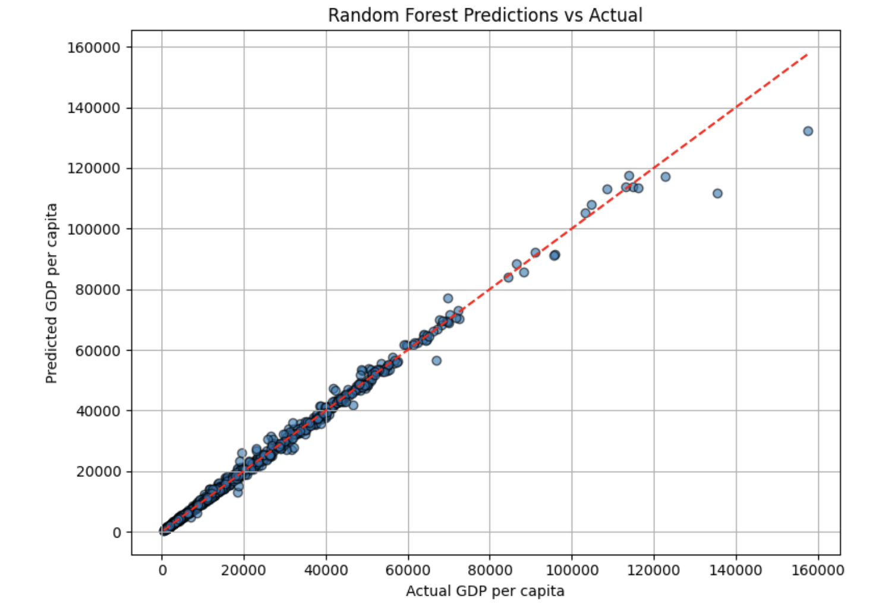

<!-- README.md -->

<h1 align="center">🥩 Meat-the-Economy  using the <em>Meatmerizor</em> model</h1>

  
  

> **Predicting economic trends one 🥩 at a time**

---

## 📜 Table of Contents
|                                                                                                 |                                                                                                      |
|-------------------------------------------------------------------------------------------------|-----------------------------------------------------------------------------------------------------:|
|[Video link](#video-link)                                                                        |[Rich vs Poor Meat Composition](#meat-type-composition-rich-vs-poor-individual-meats)                 |
|[Project Description](#project-description)                                                      |[Meat Diversity (Entropy)](#meat-diversity-entropy-vs-gdp-per-capita)                                 |
|[Project Goals](#project-goals)                                                                  |[PCA of Meat Types](#pca-of-meat-types-individual-meats-colored-by-gdp)                               |
|[Data Collection](#data-collection)                                                              |                                                                                                      |
|[Detailed description of data processing](#detailed-description-of-data-processing)              |[Average Meat Composition by Religion](#average-meat-composition-by-religion-individual-meats)        |
|[Detailed description of data modeling methods](#detailed-description-of-data-modeling-methods)  |[Random Forest Predictor](#random-forest-prediction-of-gdp-using-meat-consumption-along-with-past-gdp)|
|[R^2 Results for Individual Meats](#r2-results-for-individual-meats)                             |[SHAP Values for Predictor](#average-shap-values-mean-of-abs-value)                                   |
|[Kmeans Clustering Results](#kmeans-clustering-results-meatballs-and-gdp-per-capita)             |[Meat the Team](#about-us)                                                                            |
|[DBSCAN Results](#dbscan-results-meatballs-and-gdp-per-capita)                                   |                                                                                                      |

---

### Project Description
**The Meatmerizor** is a model that can predict the economic state of a country based on previous data of the country’s meat consumption and economic data.  
More specifically, the Meatmerizor takes in a country’s meat consumption per capita along with GDP per capita PPP for a given year in order to predict future trends. 

---

### Project Goals
- **Quantify the relationship** between meat consumption and economic growth.
- **Model economic patterns** using linear regression and clustering techniques.
- **Interpret findings** through the lens of cultural factors (e.g., religion) and dietary diversity (entropy).

---

### Data Collection
- **National meat eating history (From Kaggle)** 
- **Global GDP per capita, PPP data (From Kaggle)**

Datasets:  
https://www.kaggle.com/datasets/scibearia/meat-consumption-per-capita

---

### Detailed description of data preparation

- **Data Cleaning**: Removed records with missing GDP or meat values. (5% of the data set contained null GDP per capita PPP, abstaining from using the null years won’t have a huge impact on the analysis)
- **Feature Engineering**:
   - **Meatball**: Total per capita meat consumption.
   - **Meat Entropy**: Shannon entropy to capture meat diversity per country-year.
   - **GDP Lag**: Previous year’s GDP to reflect economic momentum.
   - **Meat Trend Slopes**: Computed per-country, per-meat trends over time.
- **Merging**: Combined cleaned meat and GDP datasets by country and year.
- **Normalization**: Applied scaling where appropriate for clustering and PCA.

---

### Detailed description of data modeling methods 
We implemented a variety of modeling techniques to analyze and predict the relationship between meat consumption and GDP:

- **Linear Regression**: Initially used to explore the Meatball–GDP relationship (R² ≈ 0.51).
- **Weighted Meatball Score**: Improved predictive power by weighting meat types based on individual R² scores (R² ≈ 0.55).
- **Clustering Models**:
  - **KMeans** revealed macro patterns in global dietary-economic groupings.
  - **DBSCAN** uncovered finer distinctions and outlier countries.
- **Random Forest Regressor**:
  - Trained on meat type trends, meatball score, entropy, and GDP lag.
  - Achieved strong performance (**R² ≈ 0.73**), showing meat data alone is a robust economic signal.
- **SHAP (SHapley Additive Values)**:
  - Interpreted feature importance.
  - Confirmed **GDP lag**, **meatball**, and **poultry trend** were dominant drivers of predictions.

This modeling progression helped us move from correlation-based insight to fully interpretable economic prediction.

---

### Linear Regression (Meatball)

---

### R^2 Results for Individual Meats
- R² for Poultry: 0.2709
- R² for Beef: 0.2062
- R² for Sheep and goat: 0.0279
- R² for Pork: 0.4859
- R² for Other meats: -0.0001
- R² for Fish and seafood: 0.1376

- R² Score for Weighted Meatball: 0.5545

While the original meatball score provided a general signal (R² ≈ 0.51), creating a weighted average based on individual meat type performance raised the model’s explanatory power to R² = 0.5545. This indicates that pork and poultry, for example, are more predictive of GDP levels than other meats like sheep or fish, and the model improves when this is reflected in the data representation.

---

### Kmeans Clustering results. (Meatballs and GDP per capita)

KMeans clustering revealed four global country profiles based on GDP and weighted meat consumption. One cluster captured low-GDP, low-meatball nations, often limited by cultural or structural barriers to meat access. Another grouped developing economies with rising meat intake, signaling growing industrial food capacity. A third cluster highlighted wealthy, high-meatball countries with Western-style diets and strong agricultural infrastructure. Finally, a small elite cluster included extremely rich nations with high meat diversity, reflecting both affluence and globalized consumption.

Cluster    
0    [Albania, Antigua and Barbuda, Argentina, Armenia]   
1    [Antigua and Barbuda, Australia, Austria, Baha...]   
2     [Afghanistan, Albania, Algeria, Angola, Armenia]   
3         [Bermuda, Ireland, Luxembourg, Macao, Qatar]   
Name: Entity, dtype: object

---

### DBSCAN results. (Meatballs and GDP per capita)

Cluster -1: ['Antigua and Barbuda' 'Austria' 'Bahamas' 'Bahrain' 'Belgium']  
Cluster 0: ['Afghanistan' 'Albania' 'Algeria' 'Angola' 'Antigua and Barbuda']  
Cluster 1: ['Austria' 'Denmark' 'Spain']  
Cluster 2: ['Belgium' 'Denmark' 'Ireland' 'Netherlands' 'Norway']  
Cluster 3: ['Brunei' 'Switzerland']  
Cluster 4: ['Bahamas' 'Croatia' 'Poland' 'Portugal' 'Spain']   
Cluster 5: ['Israel' 'New Zealand' 'Panama' 'Slovakia' 'Trinidad and Tobago']  
Cluster 6: ['Bermuda' 'Norway' 'Switzerland']  
Cluster 7: ['Saint Lucia' 'Saint Vincent and the Grenadines']

|DBSCAN_Cluster  |   WeightedMeatball |     |DBSCAN_Cluster              | GDP per capita, PPP (constant 2017 international $)|
|----------------|-------------------:|     |----------------------------|---------------------------------------------------:|
|-1              |28.056932           |     |-1                          |49359.614343                                        |
|0               |12.585853           |     |0                           |12853.347468                                        |
|1               |37.575794           |     |1                           |38839.518000                                        |
|2               |24.093620           |     |2                           |52637.827727                                        |
|3               |21.595027           |     |3                           |70663.221250                                        |
|4               |33.670416           |     |4                           |30578.904682                                        |
|5               |17.865095           |     |5                           |27974.776857                                        |
|6               |24.497552           |     |6                           |63758.010111                                        |
|7               |29.962399           |     |7                           |14131.533455                                        |

DBSCAN revealed micro-communities of economic/meat behavior that KMeans blurred out — such as “rich but moderate meat” countries (Cluster 2) vs “rich and very meaty” (Cluster 1).
Small wealthy nations (e.g. Bermuda, Brunei) tend to form their own clusters — likely due to tourism, imports, or elite consumption patterns.
Cluster 0 represents the bulk of lower-to-middle income nations, reinforcing meat as a luxury signal in global food systems.
Meatball score still matters: countries with scores over 30 consistently map to higher GDP clusters or noise (elite states).
Meanwhile, the highest GDP countries with low meatball scores didn’t even cluster well — they were marked as outliers, reinforcing their uniqueness.

---

### Meat Type Composition: Rich vs Poor. (Individual Meats)

While wealthier nations consume more meat overall, their diet composition is also distinct. Richer countries lean heavily on pork and poultry — meats typically associated with industrial farming and Westernized dietary patterns — while poorer countries consume more beef, goat, and fish, likely driven by regional availability, cultural practices, and economic access.

---

### Meat Diversity (Entropy) vs GDP per Capita

This entropy-based analysis suggests that dietary diversity may serve as a proxy for a country's position in the globalized economy. Nations with limited meat variety appear structurally constrained (by geography, religion, or supply chains) while those with higher entropy demonstrate the logistical and cultural infrastructure of developed economies.

---

### PCA of Meat Types (Individual meats, colored by GDP)

PCA reveals that meat consumption profiles are not randomly distributed. Instead, GDP stratifies countries along a dietary axis dominated by pork and poultry. This suggests that economic growth is often accompanied by dietary convergence (toward a Westernized, industrial meat standard) potentially at the expense of cultural diversity.

---

### Average Meat Composition by Religion (Individual meats)

The structure of meat consumption across countries reflects long-standing religious taboos, philosophical values, and substitution strategies. Secular and Christian-majority nations tend toward industrial meat diversity, while Muslim and Hindu populations shape diets through prohibitions and adaptations, often reinforcing regional protein alternatives like fish, goat, or poultry.

---

### Random Forest Prediction of GDP (Using meat consumption along with past GDP)

- R^2 Score: 0.9947286920285141
- RMSE: 1422.8991966523777
- 
Random Forest Predictions vs Actual: Closer to diagonal the more accurate the prediction. In this case, there are minor over and under predictions. There a few outliers as well - these could be oil nations, island nations etc. that have vibrant economies with unnatural meat consumption patterns.

### Average |SHAP| Values (mean of abs. value)

Features vs Mean |SHAP|: Shows how much of a positive or negative impact did features have in the prediction of the model. Unsurprisingly, GDP lag has a lot to do with the prediction - old gdp helps predict new gdp. This also tells us that momentum is a relevant factor. Additionally, the meats themselves are not as beneficial as the meatball, but amongst the individual meats, poultry had the strongest indicator of economic growth / decay.

---

### About Us

🤝 <strong>Meat the Team</strong>

1. Kaizia 
2. Yeabsera
3. Adham  
4. Sachin  

Thanks for helping make the Meatmerizor sizzle! 🔥

---

Made with ❤ and 🥩 by the Meatmerizor team

